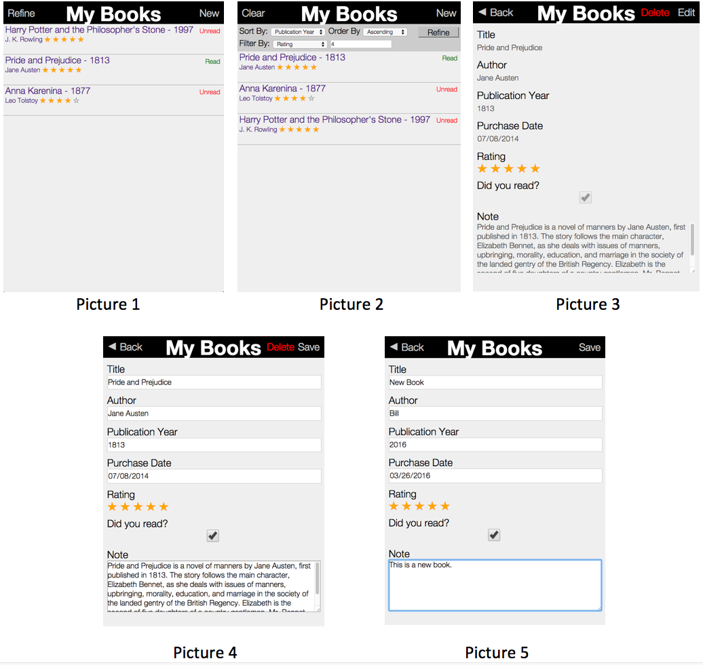

# Booklist-ember
A web app developed in Ember.js, node.js(Express), mongoDB. 

###Demo Video###
[Click me](https://youtu.be/gsAp72-Wet0)

<a href="http://www.youtube.com/watch?feature=player_embedded&v=YOUTUBE_VIDEO_ID_HERE
" target="_blank"></a>

###Installation###
1. Have [Node](https://nodejs.org/en/), [Ember-cli](http://ember-cli.com/user-guide/), [MongoDB](https://docs.mongodb.org/manual/installation/) installed on machine.
2. Run MongoDB.

    Run following code in command line, you can use `--dbpath` to specify your own data directory
    ```
    mongod
    ```
3. Run Node app. By default, running on port:3000.

    Go to node app directory, run following code.
    ```
    nodemon bin/www
    ```
4. Run Ember app.

    Go to Ember app directory, run following code. Use `--proxy` to foward http request to node app.
    ```
    Ember server --proxy http://localhost:3000
    ```
    
###Functionality###
- Homepage (Picture 1)
- Click `Refine` to sort and filter the list  (Picture 2)
- Click on a book in the list to go to `detail page`  (Picture 3)
- Click `Edit` to edit a book  (Picture 4)
- Click `New` to add a new book   (Picture 5)
- Click `Delete` to delete a book from list




